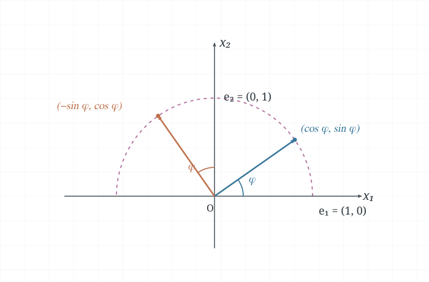

Every linear transformation from $\mathbb{R}^n$ to $\mathbb{R}^m$ can be
represented by multiplication by a unique $m\times n$ matrix. The matrix is
determined by what the transformation does to the standard basis vectors. This
representation turns questions about a transformation into familiar questions
about a matrix.

These notes are based on the handwritten
[`1-9-the-matrix-of-a-linear-transformation.pdf`](../hand-written/1-9-the-matrix-of-a-linear-transformation.pdf).
For the definition and geometric examples of linear transformations, see
[Linear Transformations](1-8-linear-transformations.md).

## The matrix determined by the standard basis

Every vector $\vec{x}\in\mathbb{R}^n$ can be written as a linear combination
of the standard basis vectors:

$$
\vec{x}=x_1\vec{e}_1+\cdots+x_n\vec{e}_n.
$$

If $T$ is linear, its value on $\vec{x}$ follows from its values on those
basis vectors.

::: {.callout-note title="Theorem 10 — The standard matrix of a linear transformation"}

**Textbook reference:** p.69

Let $T:\mathbb{R}^n\to\mathbb{R}^m$ be a linear transformation. There is a
unique $m\times n$ matrix $A$ such that

$$
T(\vec{x})=A\vec{x}
\qquad\text{for every }\vec{x}\in\mathbb{R}^n.
$$

The $j$th column of $A$ is $T(\vec{e}_j)$, the image of the $j$th standard
basis vector. Thus

$$
A=\begin{bmatrix}T(\vec{e}_1)&\cdots&T(\vec{e}_n)\end{bmatrix}.
$$

:::

The theorem follows by applying linearity to the standard-basis expansion:

$$
T(\vec{x})
=x_1T(\vec{e}_1)+\cdots+x_nT(\vec{e}_n).
$$

The image vectors therefore become the columns of the matrix that multiplies
$\vec{x}$.

### Example 1: finding a standard matrix from basis images

Suppose $T:\mathbb{R}^2\to\mathbb{R}^3$ is linear and

$$
T(\vec{e}_1)=\begin{bmatrix}5\\-7\\2\end{bmatrix},
\qquad
T(\vec{e}_2)=\begin{bmatrix}-3\\8\\0\end{bmatrix}.
$$

For $\vec{x}=\begin{bmatrix}x_1\\x_2\end{bmatrix}$, linearity gives

$$
\begin{aligned}
T(\vec{x})
&=x_1T(\vec{e}_1)+x_2T(\vec{e}_2)\\
&=\begin{bmatrix}5&-3\\-7&8\\2&0\end{bmatrix}
  \begin{bmatrix}x_1\\x_2\end{bmatrix}.
\end{aligned}
$$

Hence the standard matrix is

$$
A=\begin{bmatrix}5&-3\\-7&8\\2&0\end{bmatrix}.
$$

### Example 2: a dilation

The transformation $T(\vec{x})=3\vec{x}$ in $\mathbb{R}^2$ sends
$\vec{e}_1$ to $3\vec{e}_1$ and $\vec{e}_2$ to $3\vec{e}_2$. Its standard
matrix is therefore

$$
A=\begin{bmatrix}3&0\\0&3\end{bmatrix}=3I_2.
$$

### Example 3: rotation in $\mathbb{R}^2$

Let $T$ rotate each vector counterclockwise through an angle $\phi$. The
standard basis vectors rotate to

$$
T(\vec{e}_1)=\begin{bmatrix}\cos\phi\\\sin\phi\end{bmatrix},
\qquad
T(\vec{e}_2)=\begin{bmatrix}-\sin\phi\\\cos\phi\end{bmatrix}.
$$

These image vectors are the columns of the standard matrix:

$$
A=\begin{bmatrix}
\cos\phi&-\sin\phi\\
\sin\phi&\cos\phi
\end{bmatrix}.
$$

The two columns show where the standard basis vectors go under the rotation,
as illustrated in @fig-linear-transformation-rotation.

{#fig-linear-transformation-rotation width=70% fig-align="center"}

## Onto and one-to-one transformations

For a transformation $T:\mathbb{R}^n\to\mathbb{R}^m$, the codomain is
$\mathbb{R}^m$. A vector $\vec{b}\in\mathbb{R}^m$ is an image if at least
one input vector maps to it.

::: {.callout-note title="Onto and one-to-one"}

A mapping $T:\mathbb{R}^n\to\mathbb{R}^m$ is **onto** $\mathbb{R}^m$ if
every $\vec{b}\in\mathbb{R}^m$ is the image of at least one input vector.

It is **one-to-one** if every $\vec{b}\in\mathbb{R}^m$ is the image of at
most one input vector.

:::

For a matrix transformation $T(\vec{x})=A\vec{x}$, asking whether $T$ is
onto is the same as asking whether $A\vec{x}=\vec{b}$ is solvable for every
$\vec{b}$ in the codomain. Asking whether $T$ is one-to-one is the same as
asking whether two different inputs can have the same image.

### Example 4: onto but not one-to-one

Consider the transformation $T:\mathbb{R}^4\to\mathbb{R}^3$ with standard
matrix

$$
A=\begin{bmatrix}
1&-4&8&1\\
0&2&-1&3\\
0&0&0&5
\end{bmatrix}.
$$

The matrix has a pivot in every row, so its columns span $\mathbb{R}^3$ and
$T$ is onto. There are four variables but only three pivot positions, so
$A\vec{x}=\vec{0}$ has a free variable. The transformation is not one-to-one.

For example, to find inputs that map to
$\vec{b}=\begin{bmatrix}-2\\5\\5\end{bmatrix}$, solve
$A\vec{x}=\vec{b}$. The last equation gives $x_4=1$. Taking
$x_3=t$ then gives

$$
x_2=1+\frac{t}{2},
\qquad
x_1=1-6t.
$$

Thus every vector in the family

$$
\vec{x}(t)
=\begin{bmatrix}1-6t\\1+\tfrac12t\\t\\1\end{bmatrix}
=\begin{bmatrix}1\\1\\0\\1\end{bmatrix}
+t\begin{bmatrix}-6\\\tfrac12\\1\\0\end{bmatrix}
$$

$\vec{x}(0)=\begin{bmatrix}1\\1\\0\\1\end{bmatrix}$ and
$\vec{x}(13)=\begin{bmatrix}-77\\\tfrac{15}{2}\\13\\1\end{bmatrix}$
are two distinct preimages. The direction vector is in the null space of $A$,
so changing $t$ does not change the output.

The calculation is also available in the
[Example 4 MATLAB script](../../matlab/example_1_9_4.m).

## Matrix tests for one-to-one and onto

::: {.callout-note title="Theorem 11 — A test for one-to-one transformations"}

**Textbook reference:** p.70

Let $T:\mathbb{R}^n\to\mathbb{R}^m$ be linear. The transformation $T$ is
one-to-one if and only if the equation

$$
T(\vec{x})=\vec{0}
$$

has only the trivial solution $\vec{x}=\vec{0}$.

:::

If a nonzero vector maps to $\vec{0}$, then it has the same image as the
zero vector, so $T$ is not one-to-one. Conversely, if two inputs have the
same image, their difference maps to $\vec{0}$. A trivial null space therefore
forces the two inputs to be equal.

::: {.callout-note title="Theorem 12 — Tests using the standard matrix"}

**Textbook reference:** p.71

Let $T:\mathbb{R}^n\to\mathbb{R}^m$ be linear, and let $A$ be its standard
matrix.

- $T$ is onto $\mathbb{R}^m$ if and only if the columns of $A$ span
  $\mathbb{R}^m$.
- $T$ is one-to-one if and only if the columns of $A$ are linearly
  independent.

:::

The first condition says that every target vector is a linear combination of
the columns. The second follows because $A\vec{x}=\vec{0}$ is exactly a
linear dependence equation among those columns.

### Example 5: one-to-one but not onto

Define $T:\mathbb{R}^2\to\mathbb{R}^3$ by

$$
T(x_1,x_2)
=\begin{bmatrix}
3x_1+x_2\\
5x_1+7x_2\\
x_1+3x_2
\end{bmatrix}.
$$

Its standard matrix is

$$
A=\begin{bmatrix}3&1\\5&7\\1&3\end{bmatrix}.
$$

The columns are linearly independent: the determinant of the submatrix from
the first two rows is $3\cdot7-1\cdot5=16\ne0$. Therefore $T$ is
one-to-one. It is not onto $\mathbb{R}^3$, since two columns cannot span
$\mathbb{R}^3$. Its range is the plane

$$
\operatorname{range}(T)=\operatorname{Col}(A)
=\operatorname{span}\left\{
\begin{bmatrix}3\\5\\1\end{bmatrix},
\begin{bmatrix}1\\7\\3\end{bmatrix}
\right\}.
$$

Equivalently, this plane has equation $y_1-y_2+2y_3=0$. The matrix is also
defined in the [Example 5 MATLAB script](../../matlab/example_1_9_5.m).

## Summary

- The standard matrix of $T:\mathbb{R}^n\to\mathbb{R}^m$ has columns
  $T(\vec{e}_1),\ldots,T(\vec{e}_n)$.
- $T$ is onto exactly when its matrix columns span the codomain.
- $T$ is one-to-one exactly when its matrix columns are independent, or
  equivalently when its null space contains only $\vec{0}$.
