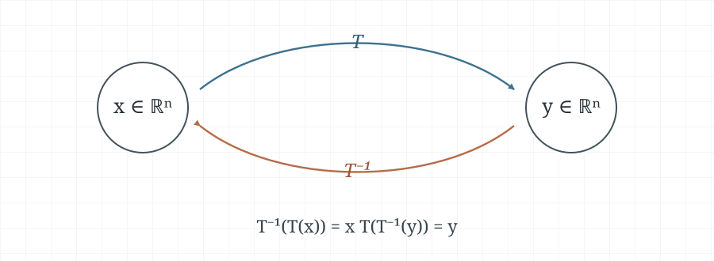

The **Invertible linear transformations** section below is based on the
handwritten note
[`2-3-characterization-of-invertible-matrices.pdf`](../hand-written/2-3-characterization-of-invertible-matrices.pdf).

For a square matrix, invertibility is not an isolated property. It is
equivalent to statements about pivots, solutions of linear systems,
linear independence, spanning, rank, and the associated linear
transformation. The following theorem gathers these viewpoints into one
practical checklist.

## The Invertible Matrix Theorem

::: {.callout-note title="Theorem 8 — The Invertible Matrix Theorem"}

**Textbook reference:** p.145; points m–q, p.189

Let $A$ be a square $n\times n$ matrix. The following statements are
equivalent. That is, for a given $A$, they are either all true or all false.

a. $A$ is an invertible matrix.
b. $A$ is row equivalent to the $n\times n$ identity matrix.
c. $A$ has $n$ pivot positions.
d. The equation $A\vec{x}=\vec{0}$ has only the trivial solution.
e. The columns of $A$ form a linearly independent set.
f. The linear transformation $\vec{x}\mapsto A\vec{x}$ is one-to-one.
g. The equation $A\vec{x}=\vec{b}$ has at least one solution for each
   $\vec{b}\in\mathbb{R}^n$.
h. The columns of $A$ span $\mathbb{R}^n$.
i. The linear transformation $\vec{x}\mapsto A\vec{x}$ maps
   $\mathbb{R}^n$ onto $\mathbb{R}^n$.
j. There is an $n\times n$ matrix $C$ such that $CA=I$.
k. There is an $n\times n$ matrix $D$ such that $AD=I$.
l. $A^T$ is an invertible matrix.
m. The columns of $A$ form a basis for $\mathbb{R}^n$.
n. $\operatorname{Col}(A)=\mathbb{R}^n$.
o. $\operatorname{rank}(A)=n$.
p. $\dim\bigl(\operatorname{Nul}(A)\bigr)=0$.
q. $\operatorname{Nul}(A)=\{\vec{0}\}$.

:::

The theorem makes it possible to choose the most convenient test for the
question at hand. For example, row reduction reveals pivots, while the
determinant gives another quick test once determinants have been introduced.

## Invertible linear transformations

Let $T\colon\mathbb{R}^n\to\mathbb{R}^n$ be a linear transformation. It is
**invertible** if there is a function $S\colon\mathbb{R}^n\to\mathbb{R}^n$
such that

$$
S\bigl(T(\vec{x})\bigr)=\vec{x}
\qquad\text{and}\qquad
T\bigl(S(\vec{x})\bigr)=\vec{x}
\quad\text{for every }\vec{x}\in\mathbb{R}^n.
$$

The first identity says that $S$ undoes $T$; the second says that $T$ undoes
$S$. Such a function is the inverse of $T$, written $T^{-1}$. The next theorem
shows that this inverse is unique and is itself a linear transformation.

@fig-inverse-transformation shows the two maps acting in opposite directions.

{#fig-inverse-transformation width=78%}

::: {.callout-note title="Theorem 9 — Invertible Linear Transformations"}

**Textbook reference:** p.147

Let $T\colon\mathbb{R}^n\to\mathbb{R}^n$ be a linear transformation, and
let $A$ be the standard matrix for $T$. Then $T$ is invertible if and only if
$A$ is an invertible matrix. In that case, the linear transformation

$$
T^{-1}(\vec{x})=A^{-1}\vec{x}
$$

is the unique inverse of $T$. Equivalently,

$$
T^{-1}\bigl(T(\vec{x})\bigr)=\vec{x}
\qquad\text{and}\qquad
T\bigl(T^{-1}(\vec{x})\bigr)=\vec{x}
$$

for every $\vec{x}\in\mathbb{R}^n$.

:::

Thus an invertible matrix and an invertible linear transformation describe the
same reversible operation: one in matrix form and the other as a function.
