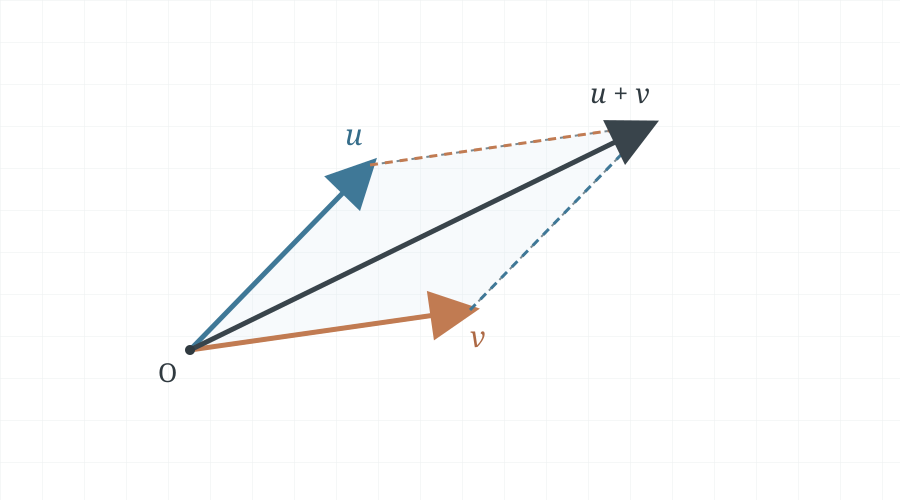
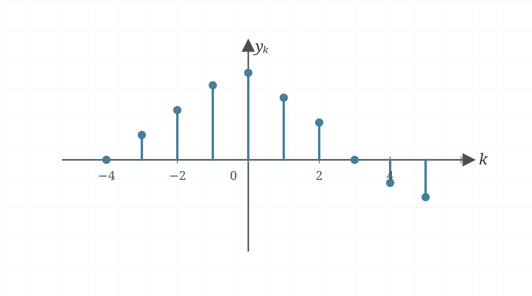
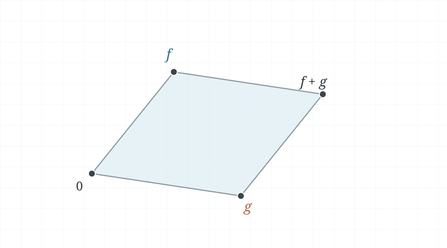
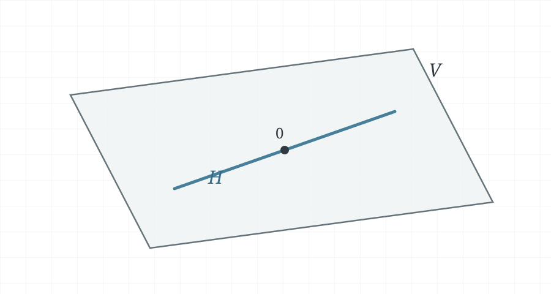
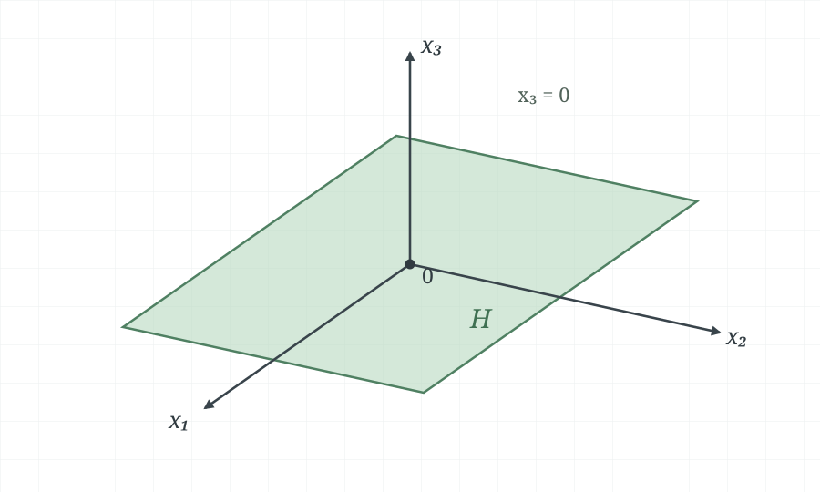
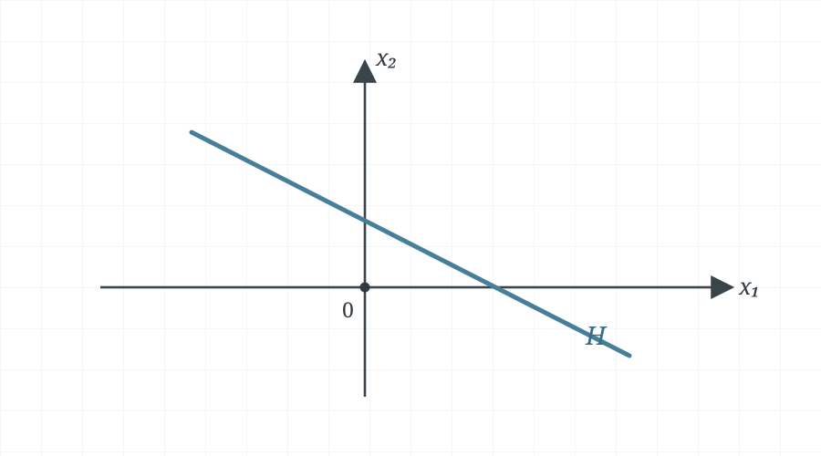
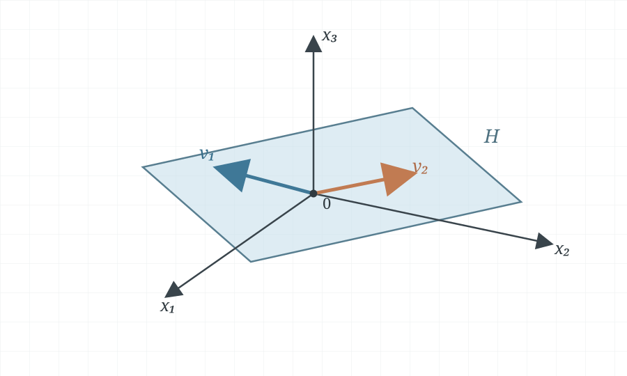

Linear algebra is not limited to arrows in two or three dimensions. A **vector
space** is a collection of objects that can be added and scaled according to
consistent rules. Its elements may be coordinate vectors, sequences,
polynomials, or functions. The common vector-space axioms let us reason about
all of these objects in the same way.

These notes are based on the handwritten note
[4-1-vector-spaces-and-subspaces.pdf](../hand-written/4-1-vector-spaces-and-subspaces.pdf).

## Vector spaces

::: {.callout-note title="Definition — Vector space"}

**Textbook reference:** pp. 226–227

A **vector space** is a nonempty set $V$ of objects, called vectors, with
operations of vector addition and multiplication by real scalars. For all
$\vec{u},\vec{v},\vec{w}\in V$ and all scalars $c,d\in\mathbb{R}$, the following
ten axioms hold:

1. **Closure under addition:** $\vec{u}+\vec{v}\in V$.
2. **Commutativity:** $\vec{u}+\vec{v}=\vec{v}+\vec{u}$.
3. **Associativity:** $(\vec{u}+\vec{v})+\vec{w}=\vec{u}+(\vec{v}+\vec{w})$.
4. **Additive identity:** There is a zero vector $\vec{0}\in V$ such that
   $\vec{u}+\vec{0}=\vec{u}$.
5. **Additive inverse:** For every $\vec{u}\in V$, there is a vector
   $-\vec{u}\in V$ such that $\vec{u}+(-\vec{u})=\vec{0}$.
6. **Closure under scalar multiplication:** $c\vec{u}\in V$.
7. **Distributivity over vector addition:** $c(\vec{u}+\vec{v})=c\vec{u}+c\vec{v}$.
8. **Distributivity over scalar addition:** $(c+d)\vec{u}=c\vec{u}+d\vec{u}$.
9. **Compatibility of scalar multiplication:** $c(d\vec{u})=(cd)\vec{u}$.
10. **Scalar identity:** $1\vec{u}=\vec{u}$.

:::

The spaces $\mathbb{R}^n$ are the standard examples. The following examples
show that vectors can be other kinds of objects, as long as addition and
scalar multiplication obey the same axioms.

### Example 1: coordinate vectors

For every integer $n\geq 1$, the set $\mathbb{R}^n$ is a vector space under
the usual coordinate-wise addition and scalar multiplication. Geometric
intuition from $\mathbb{R}^2$ and $\mathbb{R}^3$ helps us visualize many of the
ideas in this chapter.

### Example 2: geometric arrows

Consider arrows in $\mathbb{R}^2$, where two arrows are considered equal when
they have the same length and point in the same direction, regardless of
where they are drawn. Add them using the parallelogram rule. The diagonal
from the common starting point represents the sum. The construction also
shows that $\vec{u}+\vec{v}=\vec{v}+\vec{u}$, as illustrated in
@fig-vector-addition-parallelogram.

Scalar multiplication scales an arrow's length by $|c|$ and reverses its
direction when $c<0$; multiplication by zero gives the zero vector.

{#fig-vector-addition-parallelogram width=65%}

### Example 3: doubly infinite sequences

Let $S$ be the set of all doubly infinite sequences of real numbers,
$$
\{y_k\}_{k\in\mathbb{Z}}
=(\ldots,y_{-2},y_{-1},y_0,y_1,y_2,\ldots).
$$
For two sequences $\{y_k\}$ and $\{z_k\}$, define their sum and scalar
multiples term by term:

$$
\{y_k\}+\{z_k\}=\{y_k+z_k\},
\qquad
c\{y_k\}=\{cy_k\}.
$$

The vector-space axioms hold coordinate by coordinate, just as they do in
$\mathbb{R}^n$. Such sequences model discrete-time signals: a value $y_k$ is a
measurement or sample at index $k$. Signals may represent electrical,
mechanical, optical, biological, or audio quantities.
The sample values in @fig-vector-space-discrete-signal illustrate a possible
sequence.

{#fig-vector-space-discrete-signal width=70%}

### Example 4: polynomials

For an integer $n\geq 0$, let $P_n$ be the set of real polynomials of degree
at most $n$:

$$
p(t)=a_0+a_1t+a_2t^2+\cdots+a_nt^n,
\qquad a_0,\ldots,a_n\in\mathbb{R}.
$$

The zero polynomial is included in $P_n$, even though its degree is not
defined. Addition and scalar multiplication are defined in the usual way. If

$$
q(t)=b_0+b_1t+\cdots+b_nt^n,
$$

then

$$
(p+q)(t)
=(a_0+b_0)+(a_1+b_1)t+\cdots+(a_n+b_n)t^n
$$

and

$$
(cp)(t)=(ca_0)+(ca_1)t+\cdots+(ca_n)t^n.
$$

Thus adding two elements of $P_n$ or multiplying one by a real scalar still
produces an element of $P_n$.

### Example 5: real-valued functions

Let $D$ be a nonempty subset of $\mathbb{R}$, such as $\mathbb{R}$ itself or
an interval, and let $V$ be the set of all real-valued functions on $D$.
Define addition and scalar multiplication pointwise:

$$
(f+g)(t)=f(t)+g(t),
\qquad
(cf)(t)=c f(t)
\qquad (t\in D).
$$

Because these operations are defined pointwise, the vector-space axioms
follow from the corresponding properties of real numbers.

For example, on $D=\mathbb{R}$, take
$f(t)=1+\sin(2t)$ and $g(t)=2+\frac{1}{2}t$. Then

$$
(f+g)(t)=3+\sin(2t)+\frac{1}{2}t,
\qquad
(2g)(t)=4+t.
$$

Two functions are equal when they have equal values at every point in $D$.
The zero vector is the zero function, which is zero everywhere, and the
additive inverse of $f$ is $-f$.

The sketch in @fig-vector-space-function-addition marks the four points in the
parallelogram: the zero function, $f$, $g$, and their sum $f+g$.

{#fig-vector-space-function-addition width=52%}

### Examples of vector spaces

#### Example 1: coordinate spaces

For every integer $n\geq 1$, $\mathbb{R}^n$ is a vector space. The geometric
intuition developed for $\mathbb{R}^3$ helps visualize ideas that also apply
in higher and lower dimensions.

#### Example 2: arrows in $\mathbb{R}^3$

Consider directed arrows in three-dimensional space, treating two arrows as
equal when they have the same length and direction. Define addition by the
parallelogram rule and scalar multiplication by scaling an arrow. This gives
another way to represent the familiar vector operations.

#### Example 3: doubly infinite sequences

Let $\mathcal{S}$ be the set of all doubly infinite real sequences

$$
\mathbf{y}=(\ldots,y_{-2},y_{-1},y_0,y_1,y_2,\ldots).
$$

Add sequences componentwise and multiply each component by the scalar. For
example, if $\mathbf{z}\in\mathcal{S}$, then

$$
\mathbf{y}+\mathbf{z}=(\ldots,y_k+z_k,\ldots),
\qquad
c\mathbf{y}=(\ldots,cy_k,\ldots).
$$

These operations satisfy the vector-space axioms, just as they do for
coordinate vectors. Discrete-time measurements can be represented by such
sequences; their entries might describe electrical, mechanical, optical, or
audio signals.

#### Example 4: polynomials of bounded degree

For an integer $n\geq 0$, let $\mathcal{P}_n$ be the set of real polynomials
of degree at most $n$:

$$
p(t)=a_0+a_1t+a_2t^2+\cdots+a_nt^n,
\qquad a_0,\ldots,a_n\in\mathbb{R}.
$$

The zero polynomial is included in $\mathcal{P}_n$, even though its degree is
not defined. Addition and scalar multiplication act on the coefficients. For
example, if

$$
q(t)=b_0+b_1t+\cdots+b_nt^n,
$$

then

$$
(p+q)(t)=(a_0+b_0)+(a_1+b_1)t+\cdots+(a_n+b_n)t^n
$$

and

$$
(cp)(t)=ca_0+ca_1t+\cdots+ca_nt^n.
$$

#### Example 5: real-valued functions

Let $D$ be a nonempty domain and let $V$ be the set of all real-valued
functions defined on $D$. Define addition and scalar multiplication
pointwise:

$$
(\vec{f}+\vec{g})(t)=\vec{f}(t)+\vec{g}(t),
\qquad
(c\vec{f})(t)=c\vec{f}(t).
$$

For example, on $D=\mathbb{R}$, if
$\vec{f}(t)=1+\sin(2t)$ and $\vec{g}(t)=2+\frac{1}{2}t$, then

$$
(\vec{f}+\vec{g})(t)=3+\sin(2t)+\frac{1}{2}t,
\qquad
(2\vec{g})(t)=4+t.
$$

Two functions are equal when their values agree at every point in $D$. The
zero vector is the function that is identically zero, and the additive
inverse of $\vec{f}$ is $-\vec{f}$. Each function is one vector in this space,
not a collection of separate vectors indexed by its input.

## Subspaces

In many problems, a vector space of interest is a subset of a larger vector
space. Because the larger space already satisfies the vector-space axioms,
only three properties need to be checked for the subset.

::: {.callout-note title="Definition — Subspace"}

**Textbook reference:** p. 229

A subset $H$ of a vector space $V$ is a **subspace of $V$** if:

1. $\vec{0}\in H$;
2. for every $\vec{u},\vec{v}\in H$, the sum
   $\vec{u}+\vec{v}\in H$;
3. for every $\vec{u}\in H$ and every scalar $c$,
   $c\vec{u}\in H$.

:::

The first condition matters: every subspace must contain the zero vector of
the ambient space. The sketch in @fig-subspace-of-ambient-space shows a
subspace $H$ lying inside $V$ and passing through the zero vector.

{#fig-subspace-of-ambient-space width=65%}

### Example 6: the zero subspace

For any vector space $V$, the set containing only its zero vector,
$\{\vec{0}\}$, is a subspace. It contains zero, and adding or scaling zero
always gives zero. This subspace is called the **zero subspace**.

### Example 7: polynomial subspaces

Let $P$ be the vector space of all real polynomials, viewed as functions on
$\mathbb{R}$. For each $n\geq 0$, the set $P_n$ of polynomials of degree at
most $n$ is a subspace of $P$: it contains the zero polynomial, and adding or
scaling its elements cannot produce a polynomial of degree greater than $n$.

### Example 8: finitely supported signals

Let $S_f$ be the set of doubly infinite sequences for which only finitely many
terms are nonzero. The zero sequence belongs to $S_f$. The sum of two such
sequences can be nonzero only at indices where at least one of the original
sequences is nonzero, a finite union of indices. Scaling a sequence cannot
create new nonzero terms. Therefore $S_f$ is a subspace of the space $S$ of
all doubly infinite sequences.

### Example 9: a coordinate plane in $\mathbb{R}^3$

The space $\mathbb{R}^2$ itself is not a subset of $\mathbb{R}^3$: its vectors
have two entries, while vectors in $\mathbb{R}^3$ have three. However, the set

$$
H=
\left\{
\begin{bmatrix}
s\\t\\0
\end{bmatrix}
:s,t\in\mathbb{R}
\right\}
$$

is a subset of $\mathbb{R}^3$ that behaves like $\mathbb{R}^2$. It is the
$x_1x_2$-coordinate plane, where the third coordinate is zero. It contains the
zero vector, and

$$
\begin{bmatrix}s_1\\t_1\\0\end{bmatrix}
+
\begin{bmatrix}s_2\\t_2\\0\end{bmatrix}
=
\begin{bmatrix}s_1+s_2\\t_1+t_2\\0\end{bmatrix},
\qquad
c\begin{bmatrix}s\\t\\0\end{bmatrix}
=
\begin{bmatrix}cs\\ct\\0\end{bmatrix}.
$$

Both results are still in $H$, so $H$ is a subspace of $\mathbb{R}^3$. In
@fig-coordinate-plane-subspace, the shaded plane is this subspace.

{#fig-coordinate-plane-subspace width=64%}

### Example 10: a line that misses the origin

A line in $\mathbb{R}^2$ that does not pass through the origin is not a
subspace because it does not contain the zero vector. For the same reason, a
plane in $\mathbb{R}^3$ that misses the origin is not a subspace. The line in
@fig-translated-line-not-subspace illustrates the first case.

{#fig-translated-line-not-subspace width=58%}

### The subspace test

To test whether a subset is a subspace, check that it contains the zero
vector and is closed under addition and scalar multiplication. Failure of any
one condition is enough to show that it is not a subspace.

### Examples of subspaces and non-subspaces

#### Example 6: the zero subspace

For any vector space $V$, the set containing only its zero vector,
$\{\vec{0}\}$, is a subspace. It contains zero, and adding or scaling its sole
element always gives zero.

#### Example 7: bounded-degree polynomials

The space $\mathcal{P}_n$ is a subspace of $\mathcal{P}$, the vector space of
all real polynomials. It contains the zero polynomial, and the sum or scalar
multiple of polynomials of degree at most $n$ still has degree at most $n$.

#### Example 8: finitely supported signals

Let $\mathcal{S}_f$ be the subset of $\mathcal{S}$ containing sequences with
only finitely many nonzero entries. The zero sequence belongs to
$\mathcal{S}_f$. The sum of two such sequences and any scalar multiple of one
still have only finitely many nonzero entries, so $\mathcal{S}_f$ is a
subspace of $\mathcal{S}$.

#### Example 9: a coordinate plane in $\mathbb{R}^3$

The space $\mathbb{R}^2$ is not itself a subspace of $\mathbb{R}^3$: its
vectors have two entries, while vectors in $\mathbb{R}^3$ have three. However,
the set

$$
H=
\left\{
\begin{bmatrix}
s\\
t\\
0
\end{bmatrix}
:s,t\in\mathbb{R}
\right\}
$$

is a subset of $\mathbb{R}^3$ that behaves like $\mathbb{R}^2$. It contains
the zero vector, and addition and scalar multiplication preserve the zero
third component. Thus $H$ is a subspace of $\mathbb{R}^3$; geometrically, it
is the $x_1x_2$-plane.

#### Example 10: a plane that misses the origin

A plane in $\mathbb{R}^3$ that does not pass through the origin is not a
subspace because it does not contain the zero vector. For the same reason, a
line in $\mathbb{R}^2$ that misses the origin is not a subspace.

## A subspace spanned by a set

### Example 11: the span of two vectors

The span of vectors in $V$ consists of all their linear combinations. For
example, if $\vec{v}_1$ and $\vec{v}_2$ are vectors in $V$, then every element
of $H=\operatorname{span}\{\vec{v}_1,\vec{v}_2\}$ has the form

$$
\vec{u}=s_1\vec{v}_1+s_2\vec{v}_2.
$$

The zero vector belongs to $H$ by choosing $s_1=s_2=0$. If
$\vec{w}=t_1\vec{v}_1+t_2\vec{v}_2$ is another vector in $H$, then the vector
sum is

$$
\vec{u}+\vec{w}
=(s_1+t_1)\vec{v}_1+(s_2+t_2)\vec{v}_2,
$$

which is also in $H$. For any scalar $c$,

$$
c\vec{u}=(cs_1)\vec{v}_1+(cs_2)\vec{v}_2
$$

is in $H$ as well. Therefore $H$ is a subspace of $V$. The diagram
@fig-span-two-vectors-subspace shows the familiar case of two independent
vectors in $\mathbb{R}^3$, whose span is a plane through the origin.

{#fig-span-two-vectors-subspace width=64%}

::: {.callout-note title="Theorem 1 — Every span is a subspace"}

If $\vec{v}_1,\ldots,\vec{v}_p$ belong to a vector space $V$, then

$$
\operatorname{span}\{\vec{v}_1,\ldots,\vec{v}_p\}
$$

is a subspace of $V$.

:::

To verify the theorem, zero coefficients give the zero vector. Let

$$
\vec{u}=s_1\vec{v}_1+\cdots+s_p\vec{v}_p,
\qquad
\vec{w}=t_1\vec{v}_1+\cdots+t_p\vec{v}_p
$$

be vectors in the span. Their sum is

$$
\vec{u}+\vec{w}
=(s_1+t_1)\vec{v}_1+\cdots+(s_p+t_p)\vec{v}_p,
$$

so it is another vector in the span. For any scalar $c$,

$$
c\vec{u}
=(cs_1)\vec{v}_1+\cdots+(cs_p)\vec{v}_p
$$

also belongs to the span. All three subspace conditions hold.

### Example 12: recognizing a subspace from its description

Let $H$ be the set of all vectors of the form

$$
H=
\left\{
\begin{bmatrix}
a-3b\\
b-a\\
a\\
b
\end{bmatrix}
:a,b\in\mathbb{R}
\right\}.
$$

Write a general vector in $H$ as a linear combination:

$$
\begin{bmatrix}
a-3b\\
b-a\\
a\\
b
\end{bmatrix}
=
a\begin{bmatrix}1\\-1\\1\\0\end{bmatrix}
+b\begin{bmatrix}-3\\1\\0\\1\end{bmatrix}.
$$

Therefore,

$$
H=
\operatorname{span}\left\{
\begin{bmatrix}1\\-1\\1\\0\end{bmatrix},
\begin{bmatrix}-3\\1\\0\\1\end{bmatrix}
\right\}.
$$

By Theorem 1, $H$ is a subspace of $\mathbb{R}^4$.

### Example 13: testing membership in a span

For which values of $h$ is

$$
\vec{y}=
\begin{bmatrix}-4\\3\\h\end{bmatrix}
$$

in the subspace of $\mathbb{R}^3$ spanned by

$$
\vec{v}_1=
\begin{bmatrix}1\\-1\\-2\end{bmatrix},
\qquad
\vec{v}_2=
\begin{bmatrix}5\\-4\\-7\end{bmatrix},
\qquad
\vec{v}_3=
\begin{bmatrix}-3\\1\\0\end{bmatrix}?
$$

The membership condition is that the equation

$$
x_1\vec{v}_1+x_2\vec{v}_2+x_3\vec{v}_3=\vec{y}
$$

has a solution. Equivalently, row-reduce the augmented matrix:

$$
\begin{aligned}
\left[
\begin{array}{ccc|c}
1&5&-3&-4\\
-1&-4&1&3\\
-2&-7&0&h
\end{array}
\right]
&\xrightarrow[\displaystyle R_3\leftarrow R_3+2R_1]
{\displaystyle R_2\leftarrow R_2+R_1}
\left[
\begin{array}{ccc|c}
1&5&-3&-4\\
0&1&-2&-1\\
0&3&-6&h-8
\end{array}
\right]\\
&\xrightarrow{\displaystyle R_3\leftarrow R_3-3R_2}
\left[
\begin{array}{ccc|c}
1&5&-3&-4\\
0&1&-2&-1\\
0&0&0&h-5
\end{array}
\right].
\end{aligned}
$$

The system is consistent exactly when $h-5=0$. Hence

$$
\vec{y}\in\operatorname{span}\{\vec{v}_1,\vec{v}_2,\vec{v}_3\}
\qquad\Longleftrightarrow\qquad h=5.
$$

## Engineering interpretation

Vector spaces provide a common model for signals, polynomial approximations,
and other collections of quantities that can be added and scaled. A subspace
describes a family that remains closed under those operations. For example,
the span of selected vibration modes contains every response assembled from
those modes. A membership test then asks whether a measured response can be
represented by that chosen family.

## Summary

- A vector space is a set with addition and scalar multiplication that satisfy
  ten axioms.
- Coordinate vectors, geometric arrows, sequences, polynomials, and
  real-valued functions can all form vector spaces.
- A subspace contains zero and is closed under addition and scalar
  multiplication.
- Polynomial spaces and finitely supported signals provide useful examples of
  subspaces.
- The span of any finite set of vectors is a subspace.
- Membership in a span is tested by solving a vector equation or row-reducing
  an augmented matrix.
