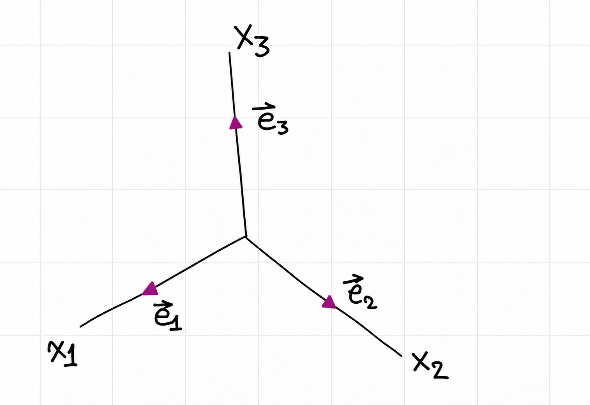
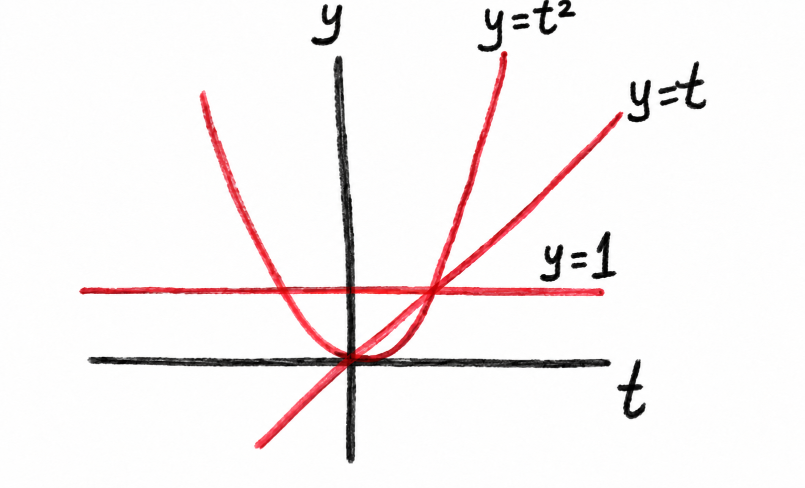
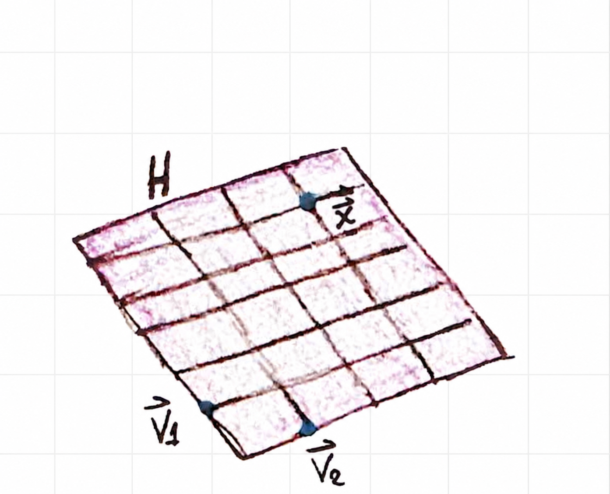

A basis is a linearly independent set that spans a vector space. Linear
independence rules out redundant vectors, while spanning ensures that every
vector in the space can be built from the set. Together, these ideas give a
compact description of a vector space and provide practical ways to find
bases for column spaces and row spaces.

These notes are based on the handwritten note
[`4-3-linearly-independent-sets-bases.pdf`](../hand-written/4-3-linearly-independent-sets-bases.pdf).
For related material, see [Linear Independence](1-7-linear-independence.md),
[Vector Spaces and Subspaces](4-1-vector-spaces-and-subspaces.md), and
[Null Spaces, Column Spaces, Row Spaces, and Linear Transformations](4-2-null-spaces-column-spaces-row-spaces-and-linear-transformations.md).

## Linear independence

An indexed set $\{\vec{v}_1,\ldots,\vec{v}_p\}$ is **linearly independent**
if the vector equation

$$
c_1\vec{v}_1+c_2\vec{v}_2+\cdots+c_p\vec{v}_p=\vec{0}
$$ {#eq-linear-independence}

has only the trivial solution $c_1=\cdots=c_p=0$. If there is a nontrivial
solution, the set is **linearly dependent**. A nontrivial solution gives a
linear dependence relation among the vectors.

The set $\{\vec{0}\}$ is dependent because $1\vec{0}=\vec{0}$ is a nontrivial
choice of coefficient. More generally, any set containing the zero vector is
dependent.

::: {.callout-note title="Theorem 4 — Characterization of linearly dependent sets"}

**Textbook reference:** p.247

Let $\{\vec{v}_1,\ldots,\vec{v}_p\}$ be an indexed set of at least two
vectors, with $\vec{v}_1\ne\vec{0}$. The set is linearly dependent if and
only if some $\vec{v}_j$, for $j>1$, is a linear combination of the preceding
vectors $\vec{v}_1,\ldots,\vec{v}_{j-1}$.

:::

### Example 1: dependent polynomials

In the vector space of polynomials, let

$$
\vec{p}_1(t)=1,\qquad \vec{p}_2(t)=t,\qquad \vec{p}_3(t)=4-t.
$$

Since $\vec{p}_3=4\vec{p}_1-\vec{p}_2$, the set
$\{\vec{p}_1,\vec{p}_2,\vec{p}_3\}$ is linearly dependent.

### Example 2: functions as vectors

In $C[0,1]$, the vector space of continuous functions on $[0,1]$,
$\{\sin t,\cos t\}$ is linearly independent. The functions are not scalar
multiples: if $\sin t=c\cos t$ for every $t\in[0,1]$, setting $t=0$ gives
$c=0$, which would make $\sin t$ the zero function.

In contrast, $\{\sin t\cos t,\sin 2t\}$ is linearly dependent because
$\sin 2t=2\sin t\cos t$ for every $t$.

## Bases

Let $H$ be a subspace of a vector space $V$. A set of vectors
$\mathcal{B}\subseteq V$ is a **basis for $H$** if it is linearly independent
and spans $H$:

$$
H=\operatorname{span}\mathcal{B}.
$$

A basis therefore has no redundant vectors, and it still generates every
vector in the space.

### Example 3: columns of an invertible matrix

If $A=[\vec{a}_1\ \cdots\ \vec{a}_n]$ is an invertible $n\times n$ matrix,
then its columns form a basis for $\mathbb{R}^n$. The Invertible Matrix
Theorem says that the columns are linearly independent and span $\mathbb{R}^n$.

### Example 4: the standard basis for $\mathbb{R}^n$

Let $\vec{e}_1,\ldots,\vec{e}_n$ be the columns of the identity matrix
$I_n$. For example,

$$
\vec{e}_1=\begin{bmatrix}1\\0\\\vdots\\0\end{bmatrix},\qquad
\vec{e}_2=\begin{bmatrix}0\\1\\\vdots\\0\end{bmatrix},\qquad
\ldots,\qquad
\vec{e}_n=\begin{bmatrix}0\\0\\\vdots\\1\end{bmatrix}.
$$

The set $\{\vec{e}_1,\ldots,\vec{e}_n\}$ is the **standard basis** for
$\mathbb{R}^n$. Its three-dimensional form is shown in
@fig-4-3-standard-basis-r3.

{#fig-4-3-standard-basis-r3 width=58% fig-align="center"}

### Example 5: testing a set of vectors in $\mathbb{R}^3$

Let

$$
\vec{v}_1=\begin{bmatrix}3\\0\\-6\end{bmatrix},\qquad
\vec{v}_2=\begin{bmatrix}-4\\1\\7\end{bmatrix},\qquad
\vec{v}_3=\begin{bmatrix}-2\\1\\5\end{bmatrix}.
$$

Place the vectors in the columns of a matrix and row-reduce:

$$
\begin{bmatrix}
3&-4&-2\\
0&1&1\\
-6&7&5
\end{bmatrix}
\sim
\begin{bmatrix}
3&-4&-2\\
0&-1&1\\
0&0&2
\end{bmatrix}
\sim I_3.
$$

There is a pivot in every column, so the vectors are linearly independent.
Three independent vectors in $\mathbb{R}^3$ span $\mathbb{R}^3$; hence
$\{\vec{v}_1,\vec{v}_2,\vec{v}_3\}$ is a basis for $\mathbb{R}^3$.

### Example 6: the standard basis for $P_n$

Let $P_n$ be the vector space of polynomials of degree at most $n$. The set

$$
\mathcal{S}=\{1,t,t^2,\ldots,t^n\}
$$

spans $P_n$, since each polynomial in the space has the form
$a_0+a_1t+\cdots+a_nt^n$. To show linear independence, suppose

$$
c_0+c_1t+c_2t^2+\cdots+c_nt^n=\vec{0}(t).
$$ {#eq-polynomial-basis-independence}

The polynomial on the left is the zero polynomial. A polynomial that is zero
for every $t$ has all coefficients equal to zero, so
$c_0=\cdots=c_n=0$. Thus $\mathcal{S}$ is linearly independent and is a
basis for $P_n$, called its **standard basis**. The functions
$1$, $t$, and $t^2$ are sketched in @fig-4-3-standard-basis-p2.

{#fig-4-3-standard-basis-p2 width=68% fig-align="center"}

## The Spanning Set Theorem

Suppose $S=\{\vec{v}_1,\ldots,\vec{v}_p\}$ is a finite set in a vector space
and $H=\operatorname{span}S$.

::: {.callout-note title="Theorem 5 — The Spanning Set Theorem"}

**Textbook reference:** p.249

1. If one vector in $S$ is a linear combination of the remaining vectors, it
   can be removed without changing the span.
2. If $H\ne\{\vec{0}\}$, some subset of $S$ is a basis for $H$.

:::

### Example 7: removing a redundant vector

Let

$$
\vec{v}_1=\begin{bmatrix}0\\2\\-1\end{bmatrix},\qquad
\vec{v}_2=\begin{bmatrix}2\\2\\0\end{bmatrix},\qquad
\vec{v}_3=\begin{bmatrix}6\\16\\-5\end{bmatrix},
\qquad
H=\operatorname{span}\{\vec{v}_1,\vec{v}_2,\vec{v}_3\}.
$$

Since $\vec{v}_3=5\vec{v}_1+3\vec{v}_2$, removing $\vec{v}_3$ does not change
the span:

$$
\operatorname{span}\{\vec{v}_1,\vec{v}_2,\vec{v}_3\}
=\operatorname{span}\{\vec{v}_1,\vec{v}_2\}.
$$

The two remaining vectors are linearly independent, so
$\{\vec{v}_1,\vec{v}_2\}$ is a basis for $H$. In general, the spanning set
theorem gives a way to remove redundant vectors until the remaining set is a
basis; removing another vector would lose the span.

{#fig-4-3-basis-for-subspace width=72% fig-align="center"}

## Bases for column and row spaces

For a matrix $A$, the null space is handled by solving $A\vec{x}=\vec{0}$;
see [the preceding section](4-2-null-spaces-column-spaces-row-spaces-and-linear-transformations.md).
The pivot columns of $A$ give a basis for its column space.

::: {.callout-note title="Theorem 6 — Pivot columns form a basis for the column space"}

**Textbook reference:** p.250

The pivot columns of a matrix $A$ form a basis for $\operatorname{Col} A$.

:::

### Example 8: finding a basis for a column space

Let

$$
B=
\begin{bmatrix}
1&4&0&2&0\\
0&0&1&-1&0\\
0&0&0&0&1\\
0&0&0&0&0
\end{bmatrix}
=\begin{bmatrix}\vec{b}_1&\vec{b}_2&\vec{b}_3&\vec{b}_4&\vec{b}_5\end{bmatrix}.
$$

The nonpivot columns satisfy $\vec{b}_2=4\vec{b}_1$ and
$\vec{b}_4=2\vec{b}_1-\vec{b}_3$. The pivot columns are therefore columns
1, 3, and 5. In fact, they are the first three standard coordinate vectors
in $\mathbb{R}^4$ with a final zero entry:

$$
\vec{b}_1=\begin{bmatrix}1\\0\\0\\0\end{bmatrix},\qquad
\vec{b}_3=\begin{bmatrix}0\\1\\0\\0\end{bmatrix},\qquad
\vec{b}_5=\begin{bmatrix}0\\0\\1\\0\end{bmatrix}.
$$

Thus $\{\vec{b}_1,\vec{b}_3,\vec{b}_5\}$ is a basis for $\operatorname{Col} B$.

### Example 9: using pivot positions from a row-equivalent matrix

Consider the matrix

$$
A=\begin{bmatrix}
1&4&0&2&-1\\
3&12&1&5&5\\
2&8&1&3&2\\
5&20&2&8&8
\end{bmatrix}.
$$

This matrix is row-equivalent to $B$ in Example 8, so its pivot columns are
1, 3, and 5. Use those same column positions in the **original matrix** $A$:

$$
\vec{a}_1=\begin{bmatrix}1\\3\\2\\5\end{bmatrix},\qquad
\vec{a}_3=\begin{bmatrix}0\\1\\1\\2\end{bmatrix},\qquad
\vec{a}_5=\begin{bmatrix}-1\\5\\2\\8\end{bmatrix}.
$$

Therefore $\{\vec{a}_1,\vec{a}_3,\vec{a}_5\}$ is a basis for
$\operatorname{Col} A$. Row operations can change a matrix's column space,
so the pivot columns must be taken from $A$, not from its row-reduced form.

::: {.callout-note title="Theorem 7 — Row-equivalent matrices have the same row space"}

**Textbook reference:** p.251

If two matrices are row-equivalent, their row spaces are equal. If one of
them is in echelon form, its nonzero rows form a basis for the row space of
both matrices.

:::

### Example 10: finding a basis for a row space

The nonzero rows of $B$ in Example 8 are linearly independent and span
$\operatorname{Row} B$. Since $A$ and $B$ are row-equivalent, they also form
a basis for $\operatorname{Row} A$:

$$
\left\{
(1,4,0,2,0),\ (0,0,1,-1,0),\ (0,0,0,0,1)
\right\}.
$$

Row reduction preserves the row space, which is why nonzero echelon rows can
be used directly to describe a row-space basis.
