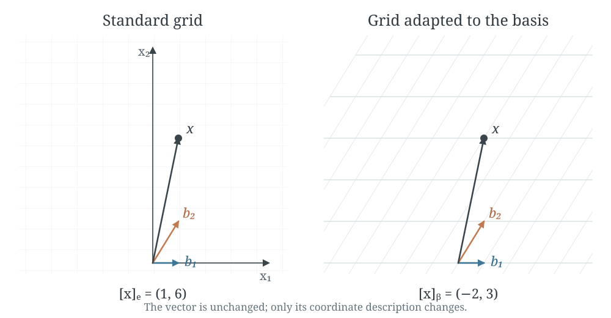
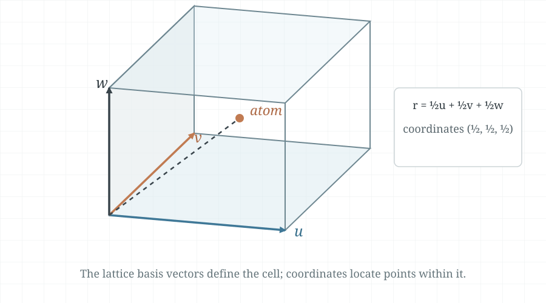
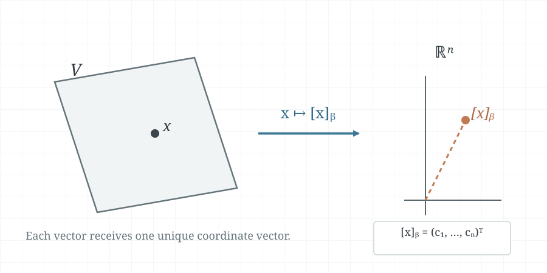
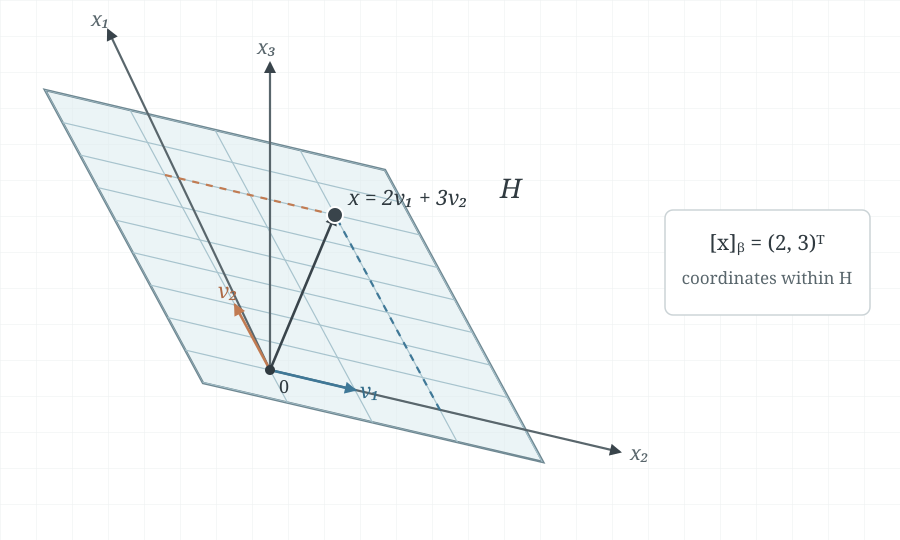

A basis gives every vector in a vector space one unique list of coefficients.
Those coefficients are the vector's coordinates relative to that basis. The
coordinate map turns an abstract vector into an ordinary vector in
$\mathbb{R}^n$, where familiar tools such as matrices and row reduction can be
used.

These notes are based on the handwritten
[`4-4-coordinate-systems.pdf`](../hand-written/4-4-coordinate-systems.pdf).
For the preceding ideas, see [Vector Spaces and Subspaces](4-1-vector-spaces-and-subspaces.md),
[Null Spaces, Column Spaces, Row Spaces, and Linear Transformations](4-2-null-spaces-column-spaces-row-spaces-and-linear-transformations.md),
and [Linearly Independent Sets and Bases](4-3-linearly-independent-sets-bases.md).
For the earlier $\mathbb{R}^2$ lesson from the professor, see
[Coordinate Systems in $\mathbb{R}^2$](examples/01-coordinate-systems-in-r2.md).
The next chapter develops dimension and rank-nullity consequences in
[Dimension of a Vector Space](4-5-dimension-of-a-vector-space.md).

## Unique representation

::: {.callout-note title="Theorem 8 — Unique Representation Theorem"}

**Textbook reference:** p.255

Let $\mathcal{B}=\{\vec{b}_1,\ldots,\vec{b}_n\}$ be a basis for a vector
space $V$. For every $\vec{x}\in V$, there is a unique set of scalars
$c_1,\ldots,c_n$ such that

$$
\vec{x}=c_1\vec{b}_1+\cdots+c_n\vec{b}_n.
$$

:::

Because $\mathcal{B}$ spans $V$, such coefficients exist. To see why they are
unique, suppose there were two representations. Subtracting them would give a
linear combination of the basis vectors equal to zero. Since the basis is
linearly independent, every coefficient in that difference must be zero.
Thus the two representations are the same.

::: {.callout-note title="Definition — Coordinates relative to a basis"}

Let $\mathcal{B}=\{\vec{b}_1,\ldots,\vec{b}_n\}$ be a basis for $V$. If

$$
\vec{x}=c_1\vec{b}_1+\cdots+c_n\vec{b}_n,
$$

then $c_1,\ldots,c_n$ are the **coordinates of $\vec{x}$ relative to
$\mathcal{B}$**. The coordinate vector is

$$
[\vec{x}]_{\mathcal{B}}=
\begin{bmatrix}
c_1\\
\vdots\\
c_n
\end{bmatrix}\in\mathbb{R}^n.
$$

:::

The vector $\vec{x}$ belongs to $V$, while its coordinate vector belongs to
$\mathbb{R}^n$. The coordinate vector records the weights needed to build
$\vec{x}$ from the basis vectors.

### Example 1: reconstructing a vector from its coordinates

Let

$$
\mathcal{B}=\left\{
\vec{b}_1=\begin{bmatrix}1\\0\end{bmatrix},
\vec{b}_2=\begin{bmatrix}1\\2\end{bmatrix}
\right\},
\qquad
[\vec{x}]_{\mathcal{B}}=\begin{bmatrix}-2\\3\end{bmatrix}.
$$

The coordinates tell us to take $-2$ copies of $\vec{b}_1$ and $3$ copies of
$\vec{b}_2$:

$$
\vec{x}=-2\vec{b}_1+3\vec{b}_2
=-2\begin{bmatrix}1\\0\end{bmatrix}
+3\begin{bmatrix}1\\2\end{bmatrix}
=\begin{bmatrix}1\\6\end{bmatrix}.
$$

### Example 2: standard coordinates

The standard basis of $\mathbb{R}^2$ is

$$
\mathcal{E}=\{\vec{e}_1,\vec{e}_2\},
\qquad
\vec{e}_1=\begin{bmatrix}1\\0\end{bmatrix},
\quad
\vec{e}_2=\begin{bmatrix}0\\1\end{bmatrix}.
$$

For $\vec{x}=\begin{bmatrix}1\\6\end{bmatrix}$, we have

$$
\vec{x}=1\vec{e}_1+6\vec{e}_2,
\qquad
[\vec{x}]_{\mathcal{E}}=\begin{bmatrix}1\\6\end{bmatrix}=\vec{x}.
$$

The coordinate vector and the vector have the same entries in the standard
basis. Other bases generally give different coordinates for the same vector.
@fig-coordinate-systems-r2 compares the same vector in the standard and
$\mathcal{B}$-adapted grids.

{#fig-coordinate-systems-r2 width=90%}

### Example 3: coordinates in a crystal lattice

A crystal lattice can be described using three basis vectors along adjacent
edges of a unit cell. The position of an atom can then be specified by its
coordinates relative to those lattice vectors. The coordinate system follows
the geometry of the lattice, rather than requiring the standard perpendicular
axes used for ordinary Cartesian coordinates. In @fig-crystal-lattice-unit-cell,
the atom is shown at the centre of a unit cell, with coordinates
$(\tfrac12,\tfrac12,\tfrac12)$ relative to its three edge vectors.

{#fig-crystal-lattice-unit-cell width=78%}

## Coordinates in $\mathbb{R}^n$

Suppose $\mathcal{B}=\{\vec{b}_1,\ldots,\vec{b}_n\}$ is a basis for
$\mathbb{R}^n$. Form the matrix whose columns are the basis vectors, written
in standard coordinates:

$$
P_{\mathcal{B}}=
\begin{bmatrix}
| & & |\\
\vec{b}_1 & \cdots & \vec{b}_n\\
| & & |
\end{bmatrix}.
$$

If $[\vec{x}]_{\mathcal{B}}=(c_1,\ldots,c_n)^T$, then multiplying by this
matrix forms the defining linear combination of the basis vectors:

$$
\vec{x}=P_{\mathcal{B}}[\vec{x}]_{\mathcal{B}}.
$$

The columns of $P_{\mathcal{B}}$ form a basis, so the matrix is invertible.
Therefore the reverse conversion is

$$
[\vec{x}]_{\mathcal{B}}=P_{\mathcal{B}}^{-1}\vec{x}.
$$

The matrix $P_{\mathcal{B}}$ converts $\mathcal{B}$-coordinates to standard
coordinates; its inverse converts standard coordinates to
$\mathcal{B}$-coordinates.

### Example 4: changing coordinates in $\mathbb{R}^2$

Let

$$
\vec{b}_1=\begin{bmatrix}2\\1\end{bmatrix},
\qquad
\vec{b}_2=\begin{bmatrix}-1\\1\end{bmatrix},
\qquad
\vec{x}=\begin{bmatrix}4\\5\end{bmatrix},
\qquad
\mathcal{B}=\{\vec{b}_1,\vec{b}_2\}.
$$

To find $[\vec{x}]_{\mathcal{B}}$, solve

$$
\begin{bmatrix}
2 & -1\\
1 & 1
\end{bmatrix}
\begin{bmatrix}c_1\\c_2\end{bmatrix}
=
\begin{bmatrix}4\\5\end{bmatrix}.
$$

The basis matrix and its inverse are

$$
P_{\mathcal{B}}=
\begin{bmatrix}2&-1\\1&1\end{bmatrix},
\qquad
P_{\mathcal{B}}^{-1}
=\frac{1}{3}\begin{bmatrix}1&1\\-1&2\end{bmatrix}.
$$

Thus

$$
[\vec{x}]_{\mathcal{B}}
=P_{\mathcal{B}}^{-1}\vec{x}
=\frac{1}{3}\begin{bmatrix}1&1\\-1&2\end{bmatrix}
\begin{bmatrix}4\\5\end{bmatrix}
=\begin{bmatrix}3\\2\end{bmatrix}.
$$

Checking the result in the original basis gives

$$
3\vec{b}_1+2\vec{b}_2
=3\begin{bmatrix}2\\1\end{bmatrix}
+2\begin{bmatrix}-1\\1\end{bmatrix}
=\begin{bmatrix}4\\5\end{bmatrix}
=\vec{x}.
$$

The same coordinates follow by row reduction:

$$
\left[
\begin{array}{cc|c}
2&-1&4\\
1&1&5
\end{array}
\right]
\sim
\left[
\begin{array}{cc|c}
1&0&3\\
0&1&2
\end{array}
\right].
$$

## The coordinate mapping

The basis $\mathcal{B}$ defines a map that sends each vector to its coordinate
vector:

$$
\vec{x}\longmapsto[\vec{x}]_{\mathcal{B}}.
$$

::: {.callout-note title="Theorem 9 — The Coordinate Mapping"}

**Textbook reference:** p.259

If $\mathcal{B}=\{\vec{b}_1,\ldots,\vec{b}_n\}$ is a basis for a vector
space $V$, then the coordinate mapping $\vec{x}\mapsto[\vec{x}]_{\mathcal{B}}$
is a one-to-one linear transformation from $V$ onto $\mathbb{R}^n$.

:::

The map is onto because every vector in $\mathbb{R}^n$ supplies coefficients
for a linear combination of the basis vectors. It is one-to-one because the
unique representation theorem gives each vector only one coordinate vector.
It also preserves linear combinations: for vectors
$\vec{u}_1,\ldots,\vec{u}_p\in V$ and scalars $c_1,\ldots,c_p$,

$$
[c_1\vec{u}_1+\cdots+c_p\vec{u}_p]_{\mathcal{B}}
=c_1[\vec{u}_1]_{\mathcal{B}}+\cdots+c_p[\vec{u}_p]_{\mathcal{B}}.
$$

Thus the coordinate mapping preserves vector addition and scalar
multiplication. It gives an isomorphism between $V$ and $\mathbb{R}^n$.
@fig-coordinate-mapping sketches this correspondence.

{#fig-coordinate-mapping width=78%}

### Example 5: coordinates of a polynomial

Consider the polynomial space $P_3$ with standard basis

$$
\mathcal{B}=\{1,t,t^2,t^3\}.
$$

Every polynomial in this space has the form

$$
p(t)=a_0+a_1t+a_2t^2+a_3t^3,
$$

so its coordinate vector is

$$
[p]_{\mathcal{B}}=
\begin{bmatrix}a_0\\a_1\\a_2\\a_3\end{bmatrix}.
$$

For example, $p(t)=2-3t+t^3$ has coordinates
$[p]_{\mathcal{B}}=(2,-3,0,1)^T$. The coordinate map represents a polynomial
by listing its coefficients in the chosen basis.

### Example 6: testing linear dependence with coordinates

In $P_2$, consider

$$
p_1(t)=1+2t^2,
\qquad
p_2(t)=4+t+5t^2,
\qquad
p_3(t)=3+2t.
$$

Relative to the standard basis $\{1,t,t^2\}$, their coordinate vectors are

$$
[p_1]=\begin{bmatrix}1\\0\\2\end{bmatrix},
\qquad
[p_2]=\begin{bmatrix}4\\1\\5\end{bmatrix},
\qquad
[p_3]=\begin{bmatrix}3\\2\\0\end{bmatrix}.
$$

Put these vectors into the columns of a matrix. Row reduction shows that the
columns are linearly dependent:

$$
\begin{bmatrix}
1&4&3\\
0&1&2\\
2&5&0
\end{bmatrix}
\sim
\begin{bmatrix}
1&0&-5\\
0&1&2\\
0&0&0
\end{bmatrix}.
$$

Taking the free variable to be $1$ gives the dependence relation

$$
5[p_1]-2[p_2]+[p_3]=\vec{0},
$$

which is equivalent to

$$
p_3(t)=2p_2(t)-5p_1(t).
$$

The coordinate mapping preserves linear combinations, so a dependence among
the coordinate vectors is exactly the same dependence among the original
polynomials. The row reduction for this example is also available as a
[MATLAB script](../../matlab/example_4_4_6.m).

### Example 7: coordinates on a plane in $\mathbb{R}^3$

Let

$$
\vec{v}_1=\begin{bmatrix}3\\6\\2\end{bmatrix},
\qquad
\vec{v}_2=\begin{bmatrix}-1\\0\\1\end{bmatrix},
\qquad
\vec{x}=\begin{bmatrix}3\\12\\7\end{bmatrix},
$$

and let $\mathcal{B}=\{\vec{v}_1,\vec{v}_2\}$ be a basis for the plane
$H=\operatorname{span}\{\vec{v}_1,\vec{v}_2\}$. To determine whether
$\vec{x}$ belongs to $H$, solve

$$
c_1\vec{v}_1+c_2\vec{v}_2=\vec{x}.
$$

The augmented matrix reduces to

$$
\begin{bmatrix}
3&-1&3\\
6&0&12\\
2&1&7
\end{bmatrix}
\sim
\begin{bmatrix}
1&0&2\\
0&1&3\\
0&0&0
\end{bmatrix},
$$

so $c_1=2$ and $c_2=3$. Therefore

$$
\vec{x}=2\vec{v}_1+3\vec{v}_2\in H,
\qquad
[\vec{x}]_{\mathcal{B}}=\begin{bmatrix}2\\3\end{bmatrix}.
$$

The plane is two-dimensional, so this basis assigns each of its vectors a
unique pair of coordinates, just as a basis of $\mathbb{R}^2$ does.
@fig-coordinate-system-plane shows the coordinate grid on $H$ and the point
with basis coordinates $(2,3)$.

{#fig-coordinate-system-plane width=80%}
