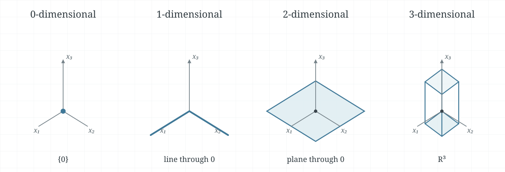
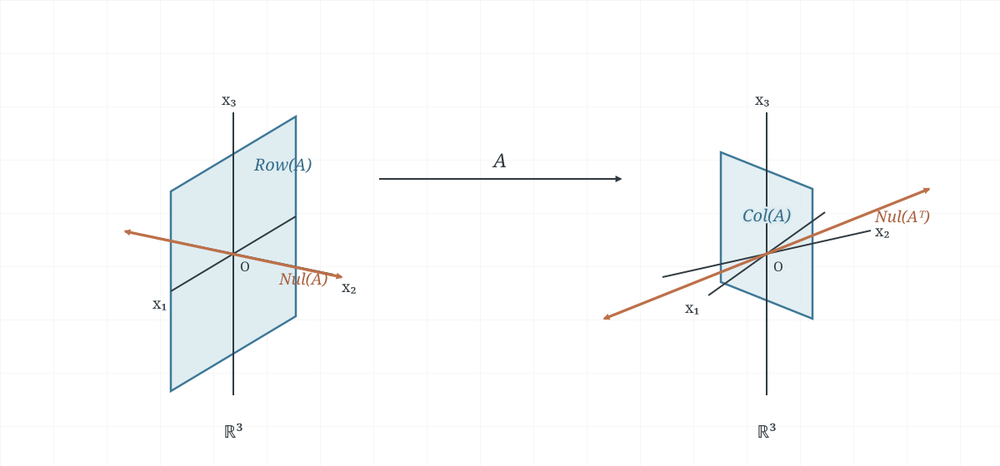

The dimension of a finite-dimensional vector space is the number of vectors in
any basis for it. This number does not depend on which basis we choose. It
counts the independent directions available in the space. For a matrix, the
dimensions of its column space and null space describe the directions its
transformation can produce and the directions it sends to zero.

These notes are based on the handwritten
[`4-5-the-dimension-of-a-vector-space.pdf`](../hand-written/4-5-the-dimension-of-a-vector-space.pdf).
For related material, see [Linearly Independent Sets and Bases](4-3-linearly-independent-sets-bases.md),
[Coordinate Systems](4-4-coordinate-systems.md), and
[Dimension and Rank](2-9-dimension-and-rank.md).

## How many vectors can be independent?

The coordinate mapping in [Coordinate Systems](4-4-coordinate-systems.md)
shows that a vector space with a basis of $n$ vectors has the same linear
structure as $\mathbb{R}^n$. In particular, no independent set in that space
can contain more than $n$ vectors.

::: {.callout-note title="Theorem 10 — An upper bound for independent sets"}

**Textbook reference:** p.265

If a vector space $V$ has a basis containing $n$ vectors, then every set in
$V$ with more than $n$ vectors is linearly dependent.

:::

::: {.callout-note title="Theorem 11 — Every basis has the same size"}

**Textbook reference:** p.265

If a vector space $V$ has a basis containing $n$ vectors, then every basis for
$V$ contains exactly $n$ vectors.

:::

Theorem 11 makes the following definition independent of the basis used.

::: {.callout-note title="Definition — Dimension"}

**Textbook reference:** p.266

A vector space is **finite-dimensional** if some finite set spans it. Its
**dimension**, written $\dim V$, is the number of vectors in any basis for
$V$. The zero vector space $\{\vec{0}\}$ has dimension zero. A vector space
that is not spanned by any finite set is **infinite-dimensional**.

:::

### Example 1: familiar vector spaces

The standard basis of $\mathbb{R}^n$ contains $n$ vectors, so
$\dim\mathbb{R}^n=n$. The polynomials of degree at most $n$ have the standard
basis $\{1,t,\ldots,t^n\}$, so $\dim P_n=n+1$. By contrast, the space
$P$ of all polynomials is infinite-dimensional: for every $k$, the set
$\{1,t,\ldots,t^k\}$ is linearly independent, so no finite set can span
$P$.

### Example 2: the dimension of a plane

Let

$$
H=\operatorname{span}\{\vec{v}_1,\vec{v}_2\},\qquad
\vec{v}_1=\begin{bmatrix}3\\6\\2\end{bmatrix},\qquad
\vec{v}_2=\begin{bmatrix}-1\\0\\1\end{bmatrix}.
$$

The vectors are nonzero and are not scalar multiples, so they are linearly
independent. They already span $H$, which makes them a basis. Therefore
$\dim H=2$.

### Example 3: removing a redundant spanning vector

Consider the subspace of $\mathbb{R}^4$

$$
H=\left\{
\begin{bmatrix}
a-3b+6c\\
5a+4d\\
b-2c-d\\
5d
\end{bmatrix}:a,b,c,d\in\mathbb{R}
\right\}.
$$

Writing the vector in terms of its parameters gives

$$
\vec{x}=a\underbrace{\begin{bmatrix}1\\5\\0\\0\end{bmatrix}}_{\vec{v}_1}
+b\underbrace{\begin{bmatrix}-3\\0\\1\\0\end{bmatrix}}_{\vec{v}_2}
+c\underbrace{\begin{bmatrix}6\\0\\-2\\0\end{bmatrix}}_{\vec{v}_3}
+d\underbrace{\begin{bmatrix}0\\4\\-1\\5\end{bmatrix}}_{\vec{v}_4}.
$$

Thus $\{\vec{v}_1,\vec{v}_2,\vec{v}_3,\vec{v}_4\}$ spans $H$. The third
vector is redundant because $\vec{v}_3=-2\vec{v}_2$. Also,
$\vec{v}_4\notin\operatorname{span}\{\vec{v}_1,\vec{v}_2\}$: its fourth
coordinate is $5$, while every vector in that span has fourth coordinate
zero. The set $\{\vec{v}_1,\vec{v}_2,\vec{v}_4\}$ is therefore a basis for
$H$, and $\dim H=3$.

<!-- pagebreak -->

## Dimensions of subspaces

The dimension of a subspace cannot exceed the dimension of the containing
space. The next theorem also explains how to turn an independent set in a
finite-dimensional space into a basis for its span or for a larger subspace.

::: {.callout-note title="Theorem 12 — Extending an independent set in a subspace"}

**Textbook reference:** p.267

Let $H$ be a subspace of a finite-dimensional vector space $V$. Every
linearly independent set in $H$ can be extended, if necessary, to a basis for
$H$. Consequently, $H$ is finite-dimensional and

$$
\dim H\leq\dim V.
$$

:::

To see why the process stops, keep adding a vector from $H$ that is not
already in the span. Each addition preserves linear independence. If
$\dim V=n$, Theorem 10 prevents this process from producing more than $n$
independent vectors. When no more vectors can be added, the set spans $H$ and
is a basis.

::: {.callout-note title="Theorem 13 — A basis test using dimension"}

**Textbook reference:** p.267

Let $V$ have dimension $p\geq 1$.

- Every linearly independent set of exactly $p$ vectors in $V$ is a basis for
  $V$.
- Every set of exactly $p$ vectors that spans $V$ is a basis for $V$.

:::

For the first statement, Theorem 12 extends the independent set to a basis.
Theorem 11 says every basis has $p$ vectors, so no additional vector can be
needed. For the second statement, the spanning set theorem extracts a basis
from the set. That basis also has $p$ vectors, so it must be the entire set.

### Example 4: subspaces of $\mathbb{R}^3$

By dimension, a subspace of $\mathbb{R}^3$ can be the zero subspace (a point
at the origin), a line through the origin, a plane through the origin, or all
of $\mathbb{R}^3$, as shown in
@fig-dimension-subspaces-r3.

{#fig-dimension-subspaces-r3 width=96%}

## Rank, nullity, and the Rank Theorem

For an $m\times n$ matrix $A$, the **rank** is the dimension of its column
space, and the **nullity** is the dimension of its null space:

$$
\operatorname{rank}(A)=\dim\operatorname{Col}(A),\qquad
\operatorname{nullity}(A)=\dim\operatorname{Nul}(A).
$$

The rank is the number of pivot columns. The nullity is the number of free
variables in $A\vec{x}=\vec{0}$. The dimension of the row space is also the
rank, since its basis contains one row for each pivot. Together these facts
give the Rank Theorem.

::: {.callout-note title="Theorem 14 — The Rank Theorem"}

**Textbook reference:** p.268

For an $m\times n$ matrix $A$,

$$
\operatorname{rank}(A)+\operatorname{nullity}(A)=n.
$$

:::

The right-hand side is the dimension of the input space $\mathbb{R}^n$. In
row-reduced form, each variable is either a pivot variable or a free variable.
Their counts are the rank and nullity, respectively, so the two counts add to
$n$. This is the same identity used in [Dimension and Rank](2-9-dimension-and-rank.md),
now expressed through the dimensions of the two spaces.

### Example 5: finding rank and nullity from row reduction

For

$$
A=\begin{bmatrix}
-3&6&-1&1&-7\\
1&-2&2&3&-1\\
2&-4&5&8&-4
\end{bmatrix},
\qquad
A\sim\begin{bmatrix}
1&-2&0&-1&3\\
0&0&1&2&-2\\
0&0&0&0&0
\end{bmatrix}.
$$

The pivot columns are columns 1 and 3, so $\operatorname{rank}(A)=2$. There
are five columns, hence

$$
\operatorname{nullity}(A)=5-2=3.
$$

### Example 6: checking possible rank and nullity values

If a $7\times9$ matrix has nullity $2$, the Rank Theorem gives
$\operatorname{rank}(A)=9-2=7$.

A $6\times9$ matrix cannot have nullity $2$. That would require rank $7$,
but the column space is a subspace of $\mathbb{R}^6$, so its dimension cannot
exceed $6$.

### Example 7: four fundamental subspaces

Let

$$
A=\begin{bmatrix}
3&0&-1\\
3&0&-1\\
4&0&5
\end{bmatrix},
\qquad
\operatorname{rref}(A)=
\begin{bmatrix}
1&0&0\\
0&0&1\\
0&0&0
\end{bmatrix}.
$$

The pivot columns are 1 and 3, so

$$
\operatorname{Col}(A)=\operatorname{span}\left\{
\begin{bmatrix}3\\3\\4\end{bmatrix},
\begin{bmatrix}-1\\-1\\5\end{bmatrix}
\right\},
\qquad
\operatorname{Nul}(A)=\operatorname{span}\left\{
\begin{bmatrix}0\\1\\0\end{bmatrix}
\right\}.
$$

Thus $\operatorname{Row}(A)$ is the $x_1x_3$-plane, which is perpendicular
to $\operatorname{Nul}(A)$, the $x_2$-axis. The column space is the plane
$x_1=x_2$. Its perpendicular direction is

$$
\operatorname{Nul}(A^T)=\operatorname{span}\left\{
\begin{bmatrix}1\\-1\\0\end{bmatrix}
\right\}.
$$

The diagram in @fig-row-column-null-orthogonality summarizes these two
relationships. The accompanying [MATLAB script](../../matlab/example_4_5_7.m)
computes the reduced matrix, column space, and null space.

{#fig-row-column-null-orthogonality width=94%}

### Example 8: what two independent solutions tell us

Suppose a homogeneous system with $42$ variables has two linearly independent
solutions, and every solution is a linear combination of those two. They form
a basis for the null space, so its nullity is $2$. If there are $40$
equations, the coefficient matrix is $40\times42$, and the Rank Theorem gives

$$
\operatorname{rank}(A)=42-2=40.
$$

The column space is therefore a $40$-dimensional subspace of $\mathbb{R}^{40}$,
so $\operatorname{Col}(A)=\mathbb{R}^{40}$. Every right-hand side
$\vec{b}\in\mathbb{R}^{40}$ can be written as $A\vec{x}$, which means the
associated nonhomogeneous system has a solution for every $\vec{b}$.
